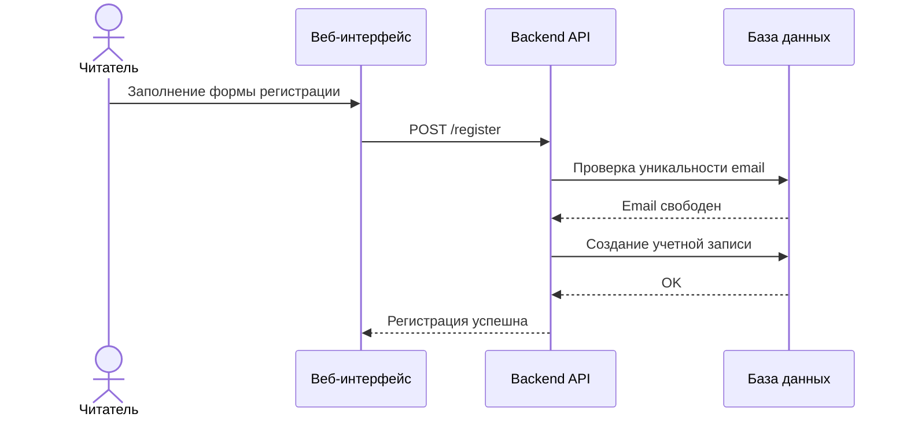
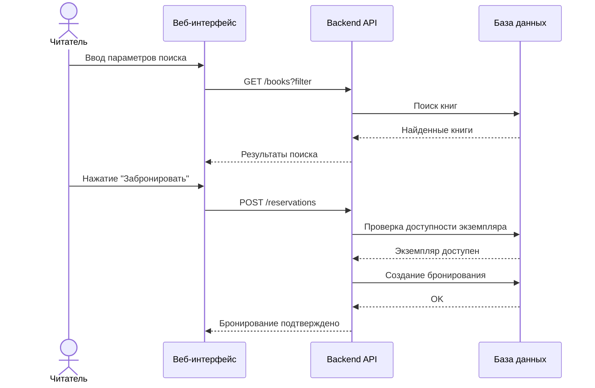
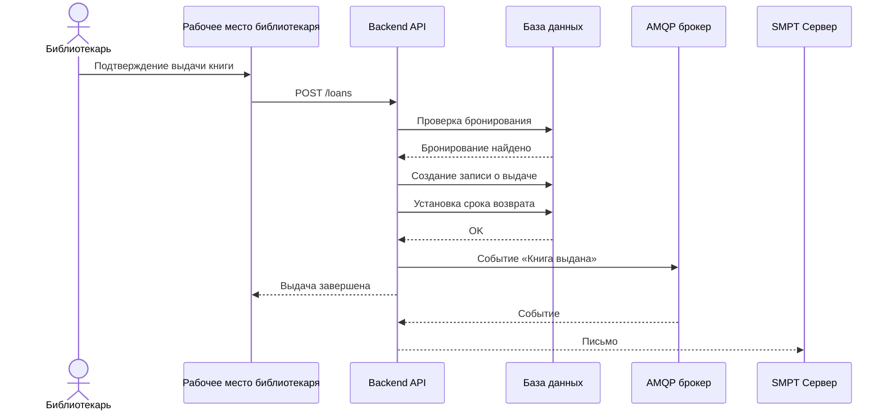
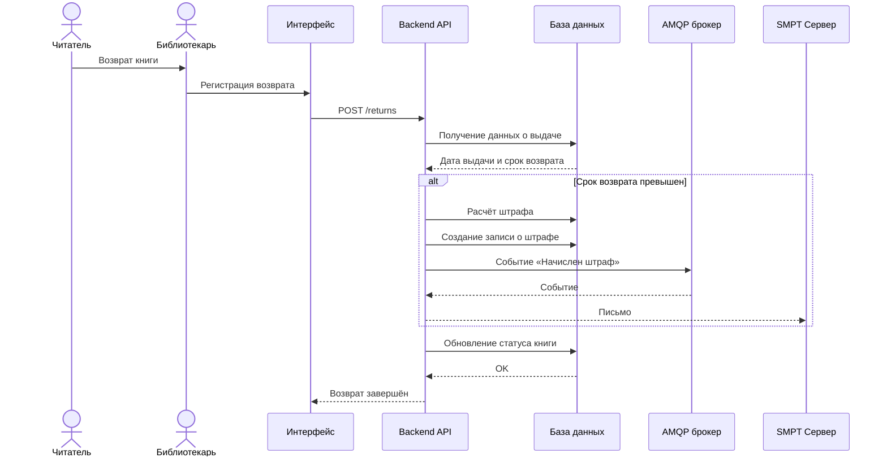
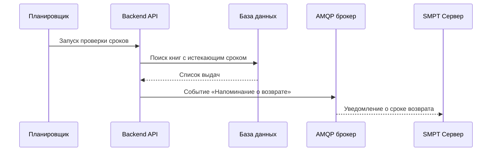

# UML Sequence Diagrams — Основные бизнес-процессы
## Система учёта библиотеки

В данном документе представлены **подробные UML Sequence Diagram**, описывающие
основные бизнес-процессы системы учёта библиотеки. Диаграммы демонстрируют
взаимодействие пользователей и компонентов системы во времени.

Диаграммы выполнены с использованием синтаксиса **Mermaid**.

---

## 1. Регистрация читателя

---

## 2. Поиск и бронирование книги

---

## 3. Выдача книги библиотекарем

---

## 4. Возврат книги и начисление штрафа

---

## 5. Уведомление о приближении срока возврата

---

## Заключение

Представленные UML Sequence Diagram подробно описывают ключевые бизнес-процессы
системы учёта библиотеки и могут использоваться в составе архитектурной и
проектной документации.
