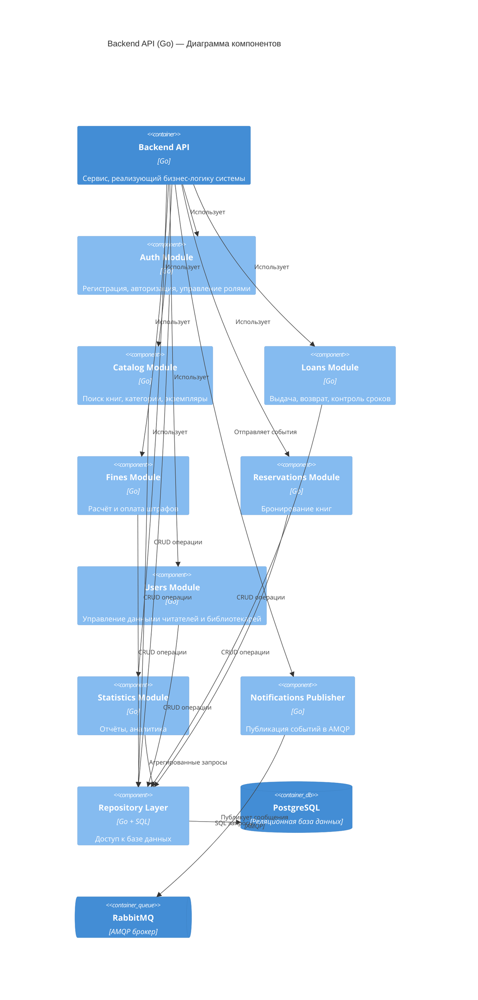

```mermaid
C4Component
title Backend API (Go) — Диаграмма компонентов

Container(api, "Backend API", "Go", "Сервис, реализующий бизнес-логику системы")

Component(auth, "Auth Module", "Go", "Регистрация, авторизация, управление ролями")
Component(catalog, "Catalog Module", "Go", "Поиск книг, категории, экземпляры")
Component(loans, "Loans Module", "Go", "Выдача, возврат, контроль сроков")
Component(fines, "Fines Module", "Go", "Расчёт и оплата штрафов")
Component(reservations, "Reservations Module", "Go", "Бронирование книг")
Component(users, "Users Module", "Go", "Управление данными читателей и библиотекарей")
Component(stats, "Statistics Module", "Go", "Отчёты, аналитика")
Component(notif, "Notifications Publisher", "Go", "Публикация событий в AMQP")
Component(repo, "Repository Layer", "Go + SQL", "Доступ к базе данных")

ContainerDb(db, "PostgreSQL", "Реляционная база данных")
ContainerQueue(queue, "RabbitMQ", "AMQP брокер")

Rel(api, auth, "Использует")
Rel(api, catalog, "Использует")
Rel(api, loans, "Использует")
Rel(api, fines, "Использует")
Rel(api, reservations, "Использует")
Rel(api, users, "Использует")
Rel(api, stats, "Использует")
Rel(api, notif, "Отправляет события")

Rel(auth, repo, "CRUD операции")
Rel(catalog, repo, "CRUD операции")
Rel(loans, repo, "CRUD операции")
Rel(reservations, repo, "CRUD операции")
Rel(fines, repo, "CRUD операции")
Rel(users, repo, "CRUD операции")
Rel(stats, repo, "Агрегированные запросы")

Rel(repo, db, "SQL запросы")

Rel(notif, queue, "Публикует сообщения", "AMQP")


```