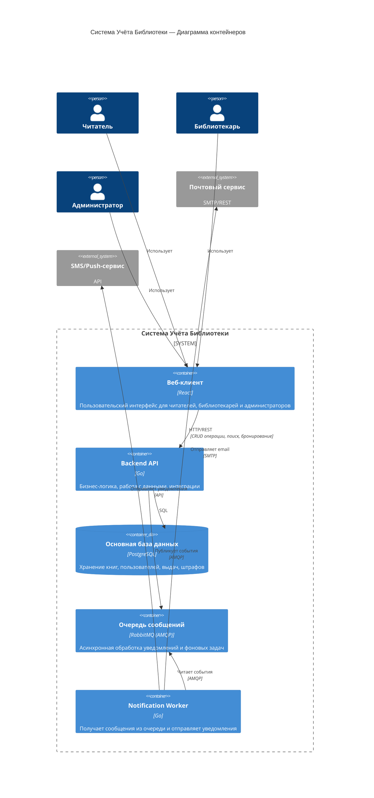

```mermaid
C4Container
title Система Учёта Библиотеки — Диаграмма контейнеров

Person(reader, "Читатель")
Person(librarian, "Библиотекарь")
Person(admin, "Администратор")

System_Boundary(system, "Система Учёта Библиотеки") {

  Container(webapp, "Веб-клиент", "React", "Пользовательский интерфейс для читателей, библиотекарей и администраторов")

  Container(api, "Backend API", "Go", "Бизнес-логика, работа с данными, интеграции")

  ContainerDb(db, "Основная база данных", "PostgreSQL", "Хранение книг, пользователей, выдач, штрафов")

  Container(queue, "Очередь сообщений", "RabbitMQ (AMQP)", "Асинхронная обработка уведомлений и фоновых задач")

  Container(worker, "Notification Worker", "Go", "Получает сообщения из очереди и отправляет уведомления")
}

System_Ext(mail, "Почтовый сервис", "SMTP/REST")
System_Ext(sms, "SMS/Push-сервис", "API")

Rel(reader, webapp, "Использует")
Rel(librarian, webapp, "Использует")
Rel(admin, webapp, "Использует")

Rel(webapp, api, "HTTP/REST", "CRUD операции, поиск, бронирование")

Rel(api, db, "SQL")
Rel(api, queue, "Публикует события", "AMQP")
Rel(worker, queue, "Читает события", "AMQP")

Rel(worker, mail, "Отправляет email", "SMTP")
Rel(worker, sms, "Отправляет уведомления", "API")

```