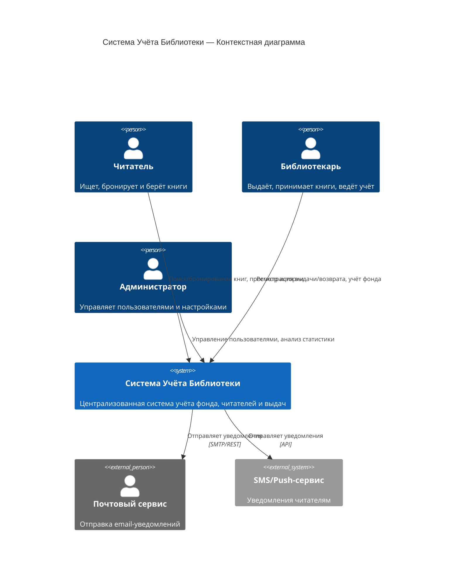

```mermaid
C4Context
title Система Учёта Библиотеки — Контекстная диаграмма

Person(reader, "Читатель", "Ищет, бронирует и берёт книги")
Person(librarian, "Библиотекарь", "Выдаёт, принимает книги, ведёт учёт")
Person(admin, "Администратор", "Управляет пользователями и настройками")

System(system, "Система Учёта Библиотеки", "Централизованная система учёта фонда, читателей и выдач")

Person_Ext(mail, "Почтовый сервис", "Отправка email-уведомлений")
System_Ext(sms, "SMS/Push-сервис", "Уведомления читателям")

Rel(reader, system, "Поиск/бронирование книг, просмотр истории")
Rel(librarian, system, "Регистрация выдачи/возврата, учёт фонда")
Rel(admin, system, "Управление пользователями, анализ статистики")

Rel(system, mail, "Отправляет уведомления", "SMTP/REST")
Rel(system, sms, "Отправляет уведомления", "API")

```