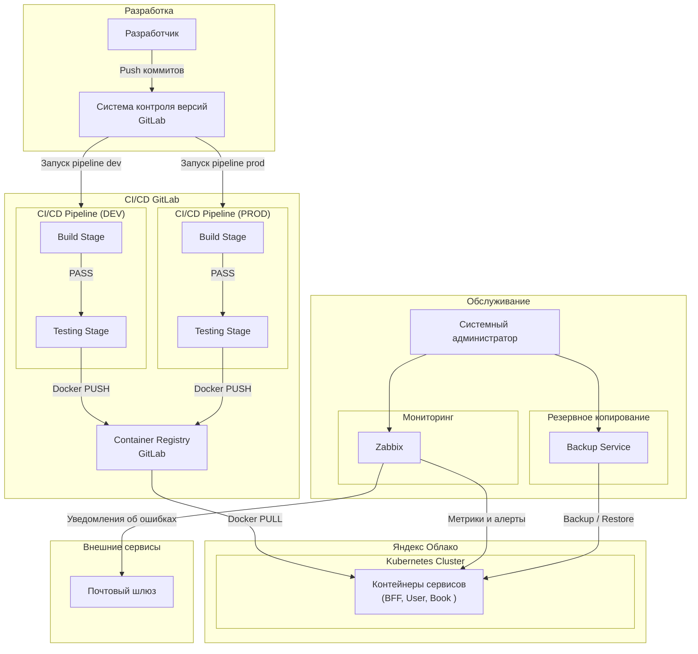

# Maintenance / Deployment
## Обслуживание и развертывание системы учета библиотеки

```mermaid
flowchart TB

%% ==== Development ====
subgraph DEV["Разработка"]
    Dev["Разработчик"]
    Git["Система контроля версий<br/>GitLab"]

    Dev -->|Push коммитов| Git
end

%% ==== CI/CD ====
subgraph CICD["CI/CD GitLab"]
    direction TB

    subgraph DEV_PIPE["CI/CD Pipeline (DEV)"]
        DevBuild["Build Stage"]
        DevTest["Testing Stage"]
        DevBuild -->|PASS| DevTest
    end

    subgraph PROD_PIPE["CI/CD Pipeline (PROD)"]
        ProdBuild["Build Stage"]
        ProdTest["Testing Stage"]
        ProdBuild -->|PASS| ProdTest
    end

    Registry["Container Registry<br/>GitLab"]

    DevTest -->|Docker PUSH| Registry
    ProdTest -->|Docker PUSH| Registry
end

Git -->|Запуск pipeline dev| DEV_PIPE
Git -->|Запуск pipeline prod| PROD_PIPE

%% ==== Cloud & Deployment ====
subgraph CLOUD["Яндекс Облако"]
    subgraph K8S["Kubernetes Cluster"]
        Containers["Контейнеры сервисов<br/>(BFF, User, Book )"]
    end
end

Registry -->|Docker PULL| Containers

%% ==== Monitoring & Backup ====
subgraph OPS[Обслуживание]
    Admin[Системный администратор]

    subgraph MON[Мониторинг]
        Zabbix[Zabbix]
    end

    subgraph BACKUP[Резервное копирование]
        BackupSystem[Backup Service]
    end

    Admin --> Zabbix
    Admin --> BackupSystem
end

Zabbix -->|Метрики и алерты| Containers
BackupSystem -->|Backup / Restore| Containers

%% ==== Notifications ====
subgraph EXT[Внешние сервисы]
    Mail[Почтовый шлюз]
end

Zabbix -->|Уведомления об ошибках| Mail
```