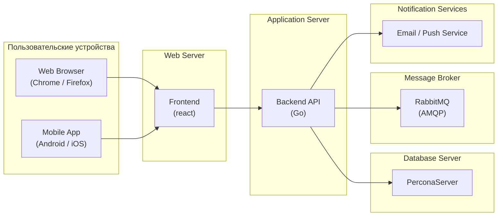

```mermaid
flowchart LR
    subgraph Client["Пользовательские устройства"]
        Browser["Web Browser\n(Chrome / Firefox)"]
        Mobile["Mobile App\n(Android / iOS)"]
    end

    subgraph Web["Web Server"]
        Frontend["Frontend\n(react)"]
    end

    subgraph App["Application Server"]
        Backend["Backend API\n(Go)"]
    end

    subgraph DBServer["Database Server"]
        DB["PerconaServer"]
    end

    subgraph MQServer["Message Broker"]
        MQ["RabbitMQ\n(AMQP)"]
    end

    subgraph NotifySrv["Notification Services"]
        Notify["Email / Push Service"]
    end

    Browser --> Frontend
    Mobile --> Frontend
    Frontend --> Backend
    Backend --> DB
    Backend --> MQ
    Backend --> Notify


```